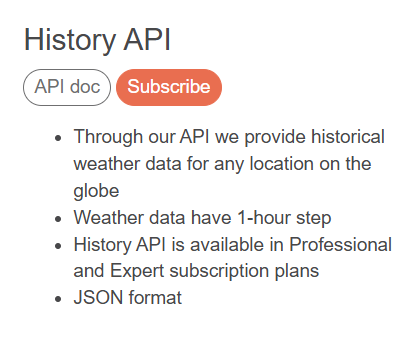

# Teste para Desenvolvedor Jr. na USE

### Antes de qualquer coisa gostaria de agradecer a oportunidade de participar do processo seletivo para esta vaga

Também de antemão, peço perdão por não implementar as funcionalidades históricas e de datas mencionadas no contexto do exercício, acontece que as funções de History API são disponíveis apenas para assinantes da OpenWeatherMapApi, e eu uso a versão Free apenas.



Como representado na foto, apenas usuários dos planos Professional e Expert tem esse recurso disponível, que é o recurso que eu acredito ser o desejado pelo Senhor na implementação.

O Endpoint seria: `https://history.openweathermap.org/data/2.5/history/city?lat={lat}&lon={lon}&type=hour&start={start}&cnt={cnt}&appid={API key}`
Para filtrar por cidade eu usaria a _Geocode API_ para buscar as coordenadas geográficas da cidade requisitada na chamada da API e aplicar nos parâmetros desse endpoint da _History API_ para filtrar por cidade e data. <u>Talvez eu tenha interpretado mal o verdadeiro propósito com a implementação de uma consulta a dados históricos e por data, se for o caso, _peço humildemente uma nova chance de fazer o teste e provar minha capacidade e demonstrar meu desejo em ser parte da equipe de desenvolvimento_</u>.

# Começando

Deixei minha API KEY dispnível no código para poupar o senhor do trabalho de gerar uma API KEY e incluí-la no código, caso contrário, teria usado a API KEY como variável de ambiente.

### Dependências do projeto

- FastAPI
- SQLite3
  Instale a FastAPI com `pip install fastapi`

Para rodar o servidor use o comando `fastapi dev main.py` após se certificar de estar dentro do ambiente virtual `.venv`. O servidor será startado na porta **8000**
Esta é uma <span style="color:#22c3ff;font-weight:bold">API REST</span> que conta com uma rota para buscar as seguintes informações por **cidade**:

- Temperatura
- Previsão
- Descrição
- Pressão
- Umidade
- Sensação térmica

---

# Tutorial

Após instalar as bibliotecas necessárias acessando o ambiente virtual `.venv`, basta rodar o código, abrir a URL em um software para avaliação de requisições como o **_Postman_** ou **_Insomnia_**, ou rodar no Browser mesmo e acessar a porta **8000** rota `/weather/{city}`

### Exemplo:

Endpoint: `http://127.0.0.1:8000/weather/Belo%20Horizonte`

Esse exemplo dará a resposta:

```JSON
{
  "city": "Belo Horizonte",
  "temperature": 22.44,
  "humidity": 93,
  "pressure": 1016,
  "feels_like": 23.17,
  "description": "few clouds",
  "main": "Clouds"
}
```

Agora esses dados estão salvos no **banco de dados**, você pode acessar o banco através do software **DBeaver**, entre outros, vamos seguir com o DBeaver como exemplo:
Fiz duas requisições para duas cidades, Belo Horizonte e Itamarandiba


- O resultado da consulta me retorna os valores obtidos na consulta no momento da requisição, **caso a cidade seja novamente chamada em uma requisição, o banco irá atualizar as informações da cidade com os novos dados obtidos**, atualizando a respectiva cidade no banco de dados.
- Observe também que o valor de temperatura foi transformado para o formato de ºC para representar os Celsius, como definido na requisição no parâmetro `units=metric`, esse parâmetro lida com qual formato a temperatura deve ser dada, em <span style="color:#1f2a80;font-weight:600;font-family:Mono">Celsius, Fahrenheit ou Kelvin</span>, nesse caso, queremos o dado em <span style="font-family:Mono;font-weight:600">Celsius</span>.

> Como resultado temos os dados das cidades buscadas sempre salvos de forma exclusiva, não havendo duplicidade de dados por cidade.

---

# Conclusão

Acabei optando por não usar o ORM SQLAlchemy, pois nunca tive experiência com esse ORM (Li a documentação para cogitar usá-lo no desenvolvimento) e achei simples a implementação dessa forma. Tenho experiência com ORMs para JS/TS apenas.
Essa foi a demonstração mais rápida e simples de uma forma de consumir dados de uma API e integrá-los a um Banco de dados. Espero ter atendido os requisitos desejados para essa implementação. Confesso que sou pouco experiente com python nesse contexto, já usei a linguagem apenas para automações com **`pyautogui`** e **`selenium`**. Sou experiente no desenvolvimento de APIs com `NodeJS` com `Express.JS` e `Spring Boot` com `JPA`, mas **estou disposto a aprender tudo sobre o ecossistema de desenvolvimento python** para aplicar e ser útil para a empresa.
Mais uma vez, agradeço!

---

Atenciosamente,
<span style="font-family:Verdana;color:#1f2a80">Luís Gustavo Ferreira Leite</span>

<div style="display:flex; justify-content:start; align-items:center;gap:12px">

<a href="https://dev-atomic-portfolio.vercel.app" target="_blank">Acesse meu portfolio aqui</a>
</div>

<p style="text-align:center;font-size:10px;margin-top:36px;">Feito com 💖 por Luís Gustavo</p>
